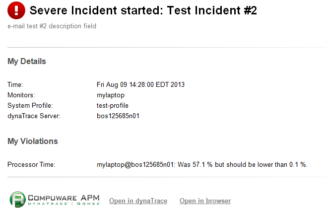

# Extended EMail Action Plugin

## Overview

This plugin provides more flexibility when it comes to sending email action alerts. You have full control over the email message that gets send and can also specify additional filtering options e.g:
just send the email when the Incident comes from a specific agent or server

## Plugin Details

| Name | Extended EMail Action Plugin
| :--- | :---
| Author | Eugene Turetsky (Eugene.Turetsky@compuware.com)
| supported dynaTrace Versions | >= 5.5
| License | [dynaTrace BSD](dynaTraceBSD.txt)
| Support | [Not Supported](https://community.compuwareapm.com/community/display/DL/Support+Levels)
| Release History | 2013-07-05 Initial Release 0.9.5,
| | 2013-08-07 Release 0.9.6
| | 2013-10-10 Release 0.9.7
| | 2013-12-27 Release 0.9.8
| | 2014-02-26 Release 0.9.9.5
| | 2014-07-01 Release 0.9.9.6
| | 2014-07-22 Release 0.9.9.7
| | 2014-09-16 Release 0.9.9.8 - 0.9.9.9 (beta)
| Download |[com.dynatrace.diagnostics.plugins.extendedmailreport_0.9.9.10.jar](com.dynatrace.diagnostics.plugins.extendedmailreport_0.9.9.10.jar)

## Java utility which verifies correctness of the Email-Filters Dependency File

Standalone Java utility mimic the Extended Mail Action plugin code which processes the Email-Filters Dependency XML files. It checks correctness of the  Email-Filters Dependency XML file based on provided XSD schema and plugin's built-in internal rules. Below are few examples of utility usage:

* getting help about utility usage:

* example of executing utility:

## New in the Release 0.9.9.14

Fixed a filtering issue for agent groups and servers. 

## New in the Release 0.9.9.13

GA release.

## New in the Release 0.9.9.8 - 0.9.9.10

New features include:

  * Ability to send notification e-mails to different addresses depending on filters criteria. The list of filters and correspondent e-mails will be provided in the XML file. Please see example of the XML file [here](filters.xml). The matching XSD schema file is located [here](filters.xsd). Plugin internally validates XML file using this schema. Please use the following link to validate correctness of the XML file outside of the plugin: [XML-validation-link](http://www.utilities-online.info/xsdvalidation/#.VBiU600tCUl).  
There are two new parameters which define if filters/e-mails pairs are used by the plugin They are (see the following [screenshot](New-plugins-parameters.png)):

    * Are Emails and Filters Coupled; 

    * Emails-Filters Dependency File. 

  * Ability to filter by agent names and by server names for the following sources (see the following [screenshot](Filters_by_servers.png) for new parameters): 

    * Agents; 

    * Monitors; 

    * Collectors. 

  * Mitigated issue with excessive invocations of the Action plugin setup/teardown methods by the dynaTrace engine. Two new properties are added to the extendedmailactionplugin.properties file. They are: 

    * expireCacheInterval; 

    * cleanupInterval. 

These parameters are taken in minutes. The _extendedmailactionplugin.properties_ file is located in the 'res' subdirectory of the plugin's jar file. Example of the extendedmailactionplugin.properties
file is located [here](extendedmailactionplugin.properties).

There are two new parameters which are added to the plugin to uniquely identify instance of the action plugin. They are:

  *     * Incident Rule Name; 

    * Identity String. 

Please see example of using these parameters [here](New_parameters.png). While the first parameter is required to identify instance of the plugin which is associated with the
specific incident rule, the second parameter is optional and only necessary when there are two or more instances of this plugin setup for a given incident rule. The last scenario of having two or more
instances of the Extended Mail Action Plugin (as well as any action plugin) for given incident rule is _highly_ _discouraged_ if incidents are thrown frequently. If you have need in having multiple
instances of the Extended Mail Action Plugin for a given incident rule, and given version of the plugin does not allow you to cover your needs with a single plugin instance, please contact us to
provide your use cases. We will make this plugin (or other action plugins) to accommodate your use cases that you will have to configure just one instance of the plugin per incident rule.

  * Added new configuration parameter ALL_SERVER_NAMES_CAPS: when it is "true", content of the ${ALL_SERVER_NAMES} environmental variable is in upper case letters, otherwise it is unchanged. 

**Note**

This version of the plugin is a beta version now. It will become a GA release after successful beta testing.

## New in the Release 0.9.9.7

Additional filtering of notification e-mails:

  * Added new configuration parameter sendOnlyPatterns: it is a semicolon separated list of Java regular [expressions](http://docs.oracle.com/javase/7/docs/api/java/util/regex/Pattern.html). Each regular expression from the sendOnlyPatterns list will be evaluated against the following incident variables: 

\- MESSAGE;  
\- RULE_DESCRIPTION;  
\- VIOLATION_HEADER_1;  
\- VIOLATION_MESSAGE_1;  
\- VIOLATION_HEADER_2;  
\- VIOLATION_MESSAGE_2;  
\- VIOLATION_HEADER_3;  
\- VIOLATION_MESSAGE_3;  
\- VIOLATION_HEADER_4;  
\- VIOLATION_MESSAGE_4;  
\- VIOLATION_HEADER_5;  
\- VIOLATION_MESSAGE_5.

Notification e-mail will be sent only if match is found in any of the above variables, otherwise notification e-mail will not be sent.

## New in the Release 0.9.9.6

Added support for e-mail notifications from the Cloud:

  * Added new configuration parameter SmtpUserPassword: when it is on, user name and password must be provided for SMTP mail server. 

## New in the Release 0.9.9.5

Changes include:

  * Removed port from the Agent_Host/Monitor_Host/Collector_Nost/Server_Host for OOTB incidents; 

  * Improved content of the e-mail body for e-mails in the plain text format; 

  * Added application name in the Details section of the e-mail body where it is available; 

  * Use of incident's message in cases where violations have no meaningful content for OOTB incidents. 

## New in the Release 0.9.9.4

Added hosts' DNS name to IP address translation for the agents, monitors, collectors, and servers. New predefined variables are added to the list of maintained by the plugin variables:

  * _AGENT_HOST_IP_ADDRESS_, 

  * _AGENT_HOST_IP_ADDRESS_1_, 

  * _AGENT_HOST_IP_ADDRESS_2_, 

  * _AGENT_HOST_IP_ADDRESS_3_, 

  * _AGENT_HOST_IP_ADDRESS_4_, 

  * _AGENT_HOST_IP_ADDRESS_5_, 

  * _ALL_AGENT_HOSTS_IP_ADDRESSES_, 

  * _MONITOR_HOST_IP_ADDRESS_, 

  * _MONITOR_HOST_IP_ADDRESS_1_, 

  * _MONITOR_HOST_IP_ADDRESS_2_, 

  * _MONITOR_HOST_IP_ADDRESS_3_, 

  * _MONITOR_HOST_IP_ADDRESS_4_, 

  * _MONITOR_HOST_IP_ADDRESS_5_, 

  * _ALL_MONITOR_HOSTS_IP_ADDRESSES_, 

  * _COLLECTOR_HOST_IP_ADDRESS_, 

  * _COLLECTOR_HOST_IP_ADDRESS_1_, 

  * _COLLECTOR_HOST_IP_ADDRESS_2_, 

  * _COLLECTOR_HOST_IP_ADDRESS_3_, 

  * _COLLECTOR_HOST_IP_ADDRESS_4_, 

  * _COLLECTOR_HOST_IP_ADDRESS_5_, 

  * _ALL_COLLECTOR_HOSTS_IP_ADDRESSES_, 

  * _SERVER_HOST_IP_ADDRESS_, 

  * _SERVER_HOST_IP_ADDRESS_1_, 

  * _SERVER_HOST_IP_ADDRESS_2_, 

  * _SERVER_HOST_IP_ADDRESS_3_, 

  * _SERVER_HOST_IP_ADDRESS_4_, 

  * _SERVER_HOST_IP_ADDRESS_5_, 

  * _ALL_SERVER_HOSTS_IP_ADDRESSE_S 

Provided write-up of the [Workaround of incorrect sensitivity issue for built-in OOTB incidents for dynaTrace action plugins](Workaround-incident-sensitivity-issue.docx).

## New in the Release 0.9.8

Added ability to embed into dashboard names predefined variables which will be substituted with their runtime values.

## New in the Release 0.9.7

Here is list of new features:

  * Added support for plain text e-mail format: 

  * new parameter "HTML Mail Format" is set to "true" for HTML notifications and "false" for ASCII/Text notifications. Default value is "true". 

  * Plugin supports now reports in HTML, PDF, XLS, XML, CSV, and XSD formats: 

    * new parameter "Dashboards Type" is set to one of the above report formats. 

  * Added new external variables supported by the plugin: 

    * DYNATRACE_SERVER_REST_PORT 

    * DASHBOARD_URL_1, DASHBOARD_URL_2,... DASHBOARD_URL_5 provide up to 5 links for dashboards' reports. 

  * Added support for "quiet time" when notification e-mails will not be sent. During quiet time incidents will be triggered as they would be during usual activities but notification e-mails will not be sent. 

  * two new parameters "Quiet Time From" and Quiet Time To" are setting up a quiet time interval. 

## New in the Release 0.9.6

Here is list of new features:

  * Significantly improved integration with the OOTB incidents; 

  * Added support for [Java regular expressions](http://docs.oracle.com/javase/7/docs/api/java/util/regex/Pattern.html) for filtering incidents by Agents, Agent Groups, Monitors, Collectors, and Servers 

  * Plugin maintains new variables which capture sources of the incidents (AGENT_NAME_1, AGENT_NAME_2, etc.); 

  * Plugin maintains new variables which capture list of incidents' sources (ALL_AGENTS, ALL_AGENT_NAMES, ALL_AGENT_HOSTS etc.); 

  * Plugin provides REST filtering of the PDF reports by agent names/hosts, group names, and/or custom timeframe; 

  * START_TIME and END_TIME variables are set to "-" if they are not defined; 

  * Separator for multiple incident's sources for filtering set to semicolon (";"). 

## Installation

Import the Plugin into the dynaTrace Server. For details how to do this please refer to the [Online Documentation on Plugin Management](https://community.compuwareapm.com/community/display/DOCDT42/Plugin+Management).

## Usage

The plugin was originally shared through the following discussion forum entry: [Automatic Dash Report via e-mail](https://community.compuwareapm.com/community/display/DTFORUM/Automatic+Dash+Report+via+e-mail).  
The following link contains documentation for the plugin: **[Extended Mail Action Plugin](attachments_156632431_1_Extended_Mail_Action_Plugin_Release_0.9.9.2.docx).**

The Extended Email Report Action Plugin has the following features:

  1. Filtering of incidents based on 

    1. agents 

    2. agent groups 

    3. monitors 

    4. collectors 

    5. servers 

  2. Customize Subject and Body of the e-mail 

    1. Add/replace Subject and/or Body of the OOTB e-mail which is generated by the Email Alert Action plugin 

  3. Embed predefined variables into the customized text in order to provide incident's details at runtime in the Subject and/or Body of the e-mail. This list consist of the following variables: 

  * _AGENT_NAME_, 

  * _AGENT_NAME_1_, 

  * _AGENT_NAME_2_, 

  * _AGENT_NAME_3_, 

  * _AGENT_NAME_4_, 

  * _AGENT_NAME_5_, 

  * _AGENT_HOST_, 

  * _AGENT_HOST_1_, 

  * _AGENT_HOST_2_, 

  * _AGENT_HOST_3_, 

  * _AGENT_HOST_4_, 

  * _AGENT_HOST_5_, 

  * _AGENT_HOST_IP_ADDRESS_, 

  * _AGENT_HOST_IP_ADDRESS_1_, 

  * _AGENT_HOST_IP_ADDRESS_2_, 

  * _AGENT_HOST_IP_ADDRESS_3_, 

  * _AGENT_HOST_IP_ADDRESS_4_, 

  * _AGENT_HOST_IP_ADDRESS_5_, 

  * _ALL_AGENT_NAMES_, 

  * _ALL_AGENT_HOSTS_, 

  * _ALL_AGENT_HOSTS_IP_ADDRESSES_, 

  * _ALL_AGENTS_, 

  * _AGENT_GROUP_NAME_, 

  * _AGENT_GROUP_NAME_1_, 

  * _AGENT_GROUP_NAME_2_, 

  * _AGENT_GROUP_NAME_3_, 

  * _AGENT_GROUP_NAME_4_, 

  * _AGENT_GROUP_NAME_5_, 

  * _ALL_AGENT_GROUP_NAMES_, 

  * _MONITOR_NAME_, 

  * _MONITOR_NAME_1_, 

  * _MONITOR_NAME_2_, 

  * _MONITOR_NAME_3_, 

  * _MONITOR_NAME_4_, 

  * _MONITOR_NAME_5_, 

  * _MONITOR_HOST_, 

  * _MONITOR_HOST_1_, 

  * _MONITOR_HOST_2_, 

  * _MONITOR_HOST_3_, 

  * _MONITOR_HOST_4_, 

  * _MONITOR_HOST_5_, 

  * _MONITOR_HOST_IP_ADDRESS_, 

  * _MONITOR_HOST_IP_ADDRESS_1_, 

  * _MONITOR_HOST_IP_ADDRESS_2_, 

  * _MONITOR_HOST_IP_ADDRESS_3_, 

  * _MONITOR_HOST_IP_ADDRESS_4_, 

  * _MONITOR_HOST_IP_ADDRESS_5_, 

  * _ALL_MONITOR_NAMES_, 

  * _ALL_MONITOR_HOSTS_, 

  * _ALL_MONITOR_HOSTS_IP_ADDRESSES_, 

  * _ALL_MONITORS_, 

  * _COLLECTOR_NAME_, 

  * _COLLECTOR_NAME_1_, 

  * _COLLECTOR_NAME_2_, 

  * _COLLECTOR_NAME_3_, 

  * _COLLECTOR_NAME_4_, 

  * _COLLECTOR_NAME_5_, 

  * _COLLECTOR_HOST_, 

  * _COLLECTOR_HOST_1_, 

  * _COLLECTOR_HOST_2_, 

  * _COLLECTOR_HOST_3_, 

  * _COLLECTOR_HOST_4_, 

  * _COLLECTOR_HOST_5_, 

  * _COLLECTOR_HOST_IP_ADDRESS_, 

  * _COLLECTOR_HOST_IP_ADDRESS_1_, 

  * _COLLECTOR_HOST_IP_ADDRESS_2_, 

  * _COLLECTOR_HOST_IP_ADDRESS_3_, 

  * _COLLECTOR_HOST_IP_ADDRESS_4_, 

  * _COLLECTOR_HOST_IP_ADDRESS_5_, 

  * _ALL_COLLECTOR_NAMES_, 

  * _ALL_COLLECTOR_HOSTS_, 

  * _ALL_COLLECTOR_HOSTS_IP_ADDRESSES_, 

  * _ALL_COLLECTORS_, 

  * _SERVER_NAME_, 

  * _SERVER_NAME_1_, 

  * _SERVER_NAME_2_, 

  * _SERVER_NAME_3_, 

  * _SERVER_NAME_4_, 

  * _SERVER_NAME_5_, 

  * _SERVER_HOST_IP_ADDRESS_, 

  * _SERVER_HOST_IP_ADDRESS_1_, 

  * _SERVER_HOST_IP_ADDRESS_2_, 

  * _SERVER_HOST_IP_ADDRESS_3_, 

  * _SERVER_HOST_IP_ADDRESS_4_, 

  * _SERVER_HOST_IP_ADDRESS_5_, 

  * _ALL_SERVER_HOSTS_IP_ADDRESSE_S 

  * _ALL_SERVER_NAMES_, 

  * _DYNATRACE_SERVER_NAME_, 

  * _DYNATRACE_SERVER_REST_PORT,_

  * _MESSAGE_, 

  * _RULE_NAME_, 

  * _RULE_DESCRIPTION_, 

  * _SENSITIVITY_, 

  * _SESSION_ID_, 

  * _SESSION_NAME_, 

  * _START_TIME_, 

  * _END_TIME_, 

  * _DURATION_, 

  * _IS_OPEN_, 

  * _IS_CLOSED_, 

  * _SEVERITY_, 

  * _KEY_, 

  * _STATE_, 

  * _SYSTEM_PROFILE_, 

  * _APPLICATION_, 

  * _VIOLATED_MEASURE_NAME_, 

  * _VIOLATED_MEASURE_DESCRIPTION_, 

  * _VIOLATED_MEASURE_VALUE_, 

  * _VIOLATED_MEASURE_UNIT_, 

  * _VIOLATED_MEASURE_SPLITTINGS_, 

  * _VIOLATED_MEASURE_TRESHOLD_UPPER_SEVERE_, 

  * _VIOLATED_MEASURE_TRESHOLD_LOWER_SEVERE_, 

  * _VIOLATED_MEASURE_TRESHOLD_UPPER_WARNING_, 

  * _VIOLATED_MEASURE_TRESHOLD_LOWER_WARNING_, 

  * _VIOLATED_MEASURE_METRIC_NAME_, 

  * _VIOLATED_MEASURE_METRIC_DESCRIPTION_, 

  * _VIOLATED_MEASURE_METRIC_GROUP_, 

  * _VIOLATED_MEASURE_METRIC_UNIT_, 

  * _VIOLATED_TRIGGER_VALUE_SOURCE_TYPE_, 

  * _VIOLATED_TRIGGER_VALUE_SOURCE_NAME_, 

  * _VIOLATED_TRIGGER_VALUE_SOURCE_HOST_, 

  * _VIOLATED_TRIGGER_VALUE_, 

  * _VIOLATION_HEADER_1_, 

  * _VIOLATION_MESSAGE_1_, 

  * _VIOLATION_HEADER_2_, 

  * _VIOLATION_MESSAGE_2_, 

  * _VIOLATION_HEADER_3_, 

  * _VIOLATION_MESSAGE_3_, 

  * _VIOLATION_HEADER_4_, 

  * _VIOLATION_MESSAGE_4_, 

  * _VIOLATION_HEADER_5_, 

  * _VIOLATION_MESSAGE_5_, 

  * _INCIDENT_STARTED_ENDED_, 

  * _IMAGE_WARNING_OK,_

  * _DASHBOARD_URL_1,_

  * _DASHBOARD_URL_2,_

  * _DASHBOARD_URL_3,_

  * _DASHBOARD_URL_4,_

  * _DASHBOARD_URL_5.__ _  

  * Attach multiple custom and/or OOTB dashboards in PDF format 

    1. Filter reports using agent-names/agent-hosts, agent-groups, and/or custom timeframe 

  * Customize To, CC, and BCC fields of the e-mail by providing lists of e-mail addresses 

  * Set From e-mail address 

  * Set specific SMTP mail server 

The plugin provides a great extension to the default Email Alert Action plugin.

## Configuration

The following screenshot shows an example configuration for non-SSL SMTP server.
  
  
Next screenshot shows an example configuration for SSL SMTP server:

Next screenshot shows Report Filtering by Agent Name/Agent Host, Agent Group, and Custom Timeframe: 

Next screenshot shows an example configuration of the Body parameter:

Next screenshot contains more complex example of the Body parameter (full content of the Body parameter is [here](attachments_154697847_1_BodyExample.html)):
  
Next screenshot shows e-mail which was created by the Body depicted in the previous screenshot:
  
For more examples of Body, Body Header, and Body Footer parameters please see pages 11 - 13 of the **[Extended Mail Action Plugin**](attachments_121569655_15_Extended_Mail_Action_Plugin.docx)
document.

Next screenshot shows an example configuration of filtering by agents:
  
For more details about filtering see section 2 on page 7 of the **[Extended Mail Action Plugin](attachments_132120588_7_Extended_Mail_Action_Plugin_Release_0.9.6.docx)** document.

Next screenshot shows an example configuration for generating and attaching PDF files to the e-mail:

## Custom Text

The following notation is used to embed predefined variables in the text:

  * ${variable-name}, where variable-name is one of the names from the list of predefined variables. 

Next is an example of custom text:

"I do not like incidents, especially when they are coming from the agent ${AGENT_NAME} which is running on the host ${AGENT_HOST}"

For more examples see section 4 on page 9 of the **[Extended Mail Action Plugin](attachments_132120588_7_Extended_Mail_Action_Plugin_Release_0.9.6.docx)** document.

##

## Feedback

Please provide feedback on this plugin either by commenting on this page or by comments on the [Community Plugins and Extensions](https://community.compuwareapm.com/community/display/DTFORUM/Community+Plugins+and+Extensions)

